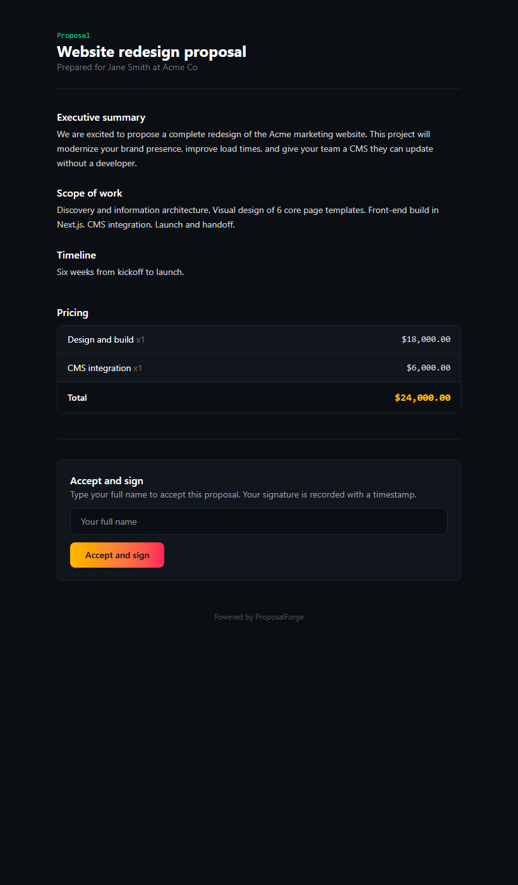
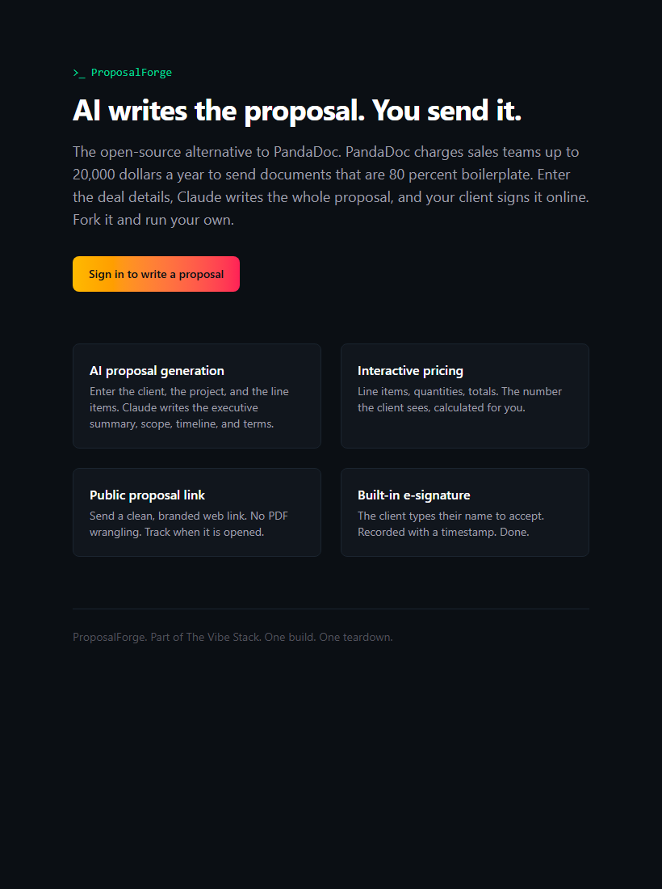

# ProposalForge

AI writes the proposal. You send it. The open-source alternative to PandaDoc.

PandaDoc charges sales teams up to 20,000 dollars a year to send documents that are 80 percent boilerplate. Underneath, a proposal is deal details, a pricing table, and a signature. This is that, rebuilt with Next.js, Supabase, and Claude: enter the deal details, Claude writes the whole proposal, and your client signs it online. Fork it and run your own.

Built in public as part of **[The Vibe Stack](https://thevibestacknews.com)** — the newsletter where I rebuild a $100K enterprise SaaS tool every week and give you the repo. One build. One teardown. Every week.

**[Subscribe at thevibestacknews.com](https://thevibestacknews.com)** to get the next build.

---





---

## What it does (MVP)

- **AI proposal generation.** Enter the client, the project, and the line items. Claude writes the executive summary, scope of work, timeline, and terms.
- **Interactive pricing.** Line items, quantities, calculated totals.
- **Public proposal link.** Send a clean, branded web link at `/view/[token]`. No login required for the prospect. Opens are tracked.
- **Built-in e-signature.** The prospect types their name to accept. Recorded with a timestamp and IP. The owner sees it marked signed.

## What is on the roadmap (in the full PRD, not the MVP)

Stripe payment collection, PDF export, full template library with brand presets, per-section view analytics, multi-party signature workflows, CRM integration, content library of reusable sections.

---

## Run it yourself

You need a free [Supabase](https://supabase.com) project and an [Anthropic API key](https://console.anthropic.com).

### 1. Clone and install

```
git clone <this repo>
cd proposalforge
npm install
```

### 2. Create the database

In your Supabase project's SQL editor, run `supabase/migration.sql`. It creates 4 tables with row-level security.

### 3. Set your environment

Copy `.env.example` to `.env.local` and fill in:

```
NEXT_PUBLIC_SUPABASE_URL=https://your-project.supabase.co
NEXT_PUBLIC_SUPABASE_ANON_KEY=your-anon-key
ANTHROPIC_API_KEY=sk-ant-your-key
SUPABASE_SERVICE_ROLE_KEY=your-service-role-key
```

The service role key is server-side only (never exposed to the client). It lets an unauthenticated prospect record their e-signature on the public proposal view. Everything else works without it.

### 4. Run

```
npm run dev
```

Open http://localhost:3000. Sign in at `/login` (magic link), land in the admin, click New proposal, enter the deal, click "Generate with AI," then Save and Send. The prospect opens the link, reads the proposal, and signs.

### 5. (Optional) Smoke test

```
npm run build && npm run start
npm run smoke
```

---

## Deploy to Vercel

1. Push to GitHub and import in Vercel.
2. Add the four environment variables from step 3.
3. Deploy. No cron needed.

---

## The stack

- Next.js 16 (App Router) + React 19
- Supabase (Postgres + auth + row-level security)
- Claude (writes the proposal)
- Tailwind CSS

## Notes on security

- Row-level security is on for every table. The public can read only sent proposals (drafts stay private). The signature write goes through a server route using the service role key, gated by the unguessable view token.
- The Supabase anon key is public by design (RLS does the protecting). The service role key is server-only.

## License

MIT. Fork it, ship it, run your own.

---

## Want the next one?

I rebuild a different enterprise SaaS tool every week and hand you the repo. PandaDoc this week. Something that costs $100K+ next week.

**[Subscribe to The Vibe Stack at thevibestacknews.com](https://thevibestacknews.com)**
